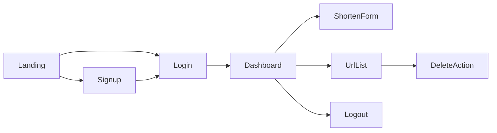

# Frontend Implementation Plan

Plan for building the React frontend of **URL Shortener App** against the existing Express + JWT + PostgreSQL backend. This document is the implementation guide; it does not include feature code yet.

## Goals

- Ship a public marketing landing page plus auth and dashboard flows.
- Call only the APIs that already exist in `backend/`.
- Keep the stack close to the current Vite + React 19 + TypeScript scaffold.

## Locked Decisions

| Decision | Choice |
| -------- | ------ |
| Pages | Landing, Login, Signup, Dashboard |
| Routing | `react-router-dom` |
| HTTP client | Native `fetch` |
| Auth storage | `localStorage` for JWT |
| Styling | Plain CSS with design tokens (no UI library) |
| API base URL | `VITE_API_URL` (e.g. `http://localhost:3000`) |

## Backend Contract

Source of truth: [`backend/src/app.ts`](../backend/src/app.ts), [`backend/src/routes/`](../backend/src/routes/), [`backend/src/validations/request.validation.ts`](../backend/src/validations/request.validation.ts).

### Endpoints the SPA uses

| Method | Path | Auth | UI use |
| ------ | ---- | ---- | ------ |
| `POST` | `/user/signup` | No | Signup form |
| `POST` | `/user/login` | No | Login → store JWT |
| `POST` | `/shorten` | Bearer JWT | Create short link |
| `GET` | `/codes` | Bearer JWT | Dashboard list |
| `DELETE` | `/:id` | Bearer JWT | Delete a URL by UUID |

### Endpoint the SPA does **not** call

| Method | Path | Notes |
| ------ | ---- | ----- |
| `GET` | `/:shortCode` | Browser redirect handled by the API. The UI only **displays** links like `{API_BASE}/{shortCode}` for users to open/copy. |

### Request / response shapes

#### `POST /user/signup`

```json
{
  "firstName": "John",
  "lastName": "Doe",
  "email": "john.doe@example.com",
  "password": "secret123"
}
```

- `firstName` — required string
- `lastName` — optional
- `email` — valid email
- `password` — min length 3 (backend schema); treat UI as min 6 for better UX, still accept API errors
- Success `201`: `{ "message": "...", "data": { "id": "<uuid>" } }`
- Errors: `400` validation, `409` email already exists, `500`

#### `POST /user/login`

```json
{
  "email": "john.doe@example.com",
  "password": "secret123"
}
```

- Success `200`: `{ "message": "Login successfully!", "token": "<jwt>" }`
- Errors: `400` validation / invalid password, `404` user not found

JWT payload (for client-side decode of email/id only; do not trust for auth): `{ id, email }`.

#### `POST /shorten` (auth required)

```http
Authorization: Bearer <jwt>
Content-Type: application/json
```

```json
{
  "url": "https://example.com/very/long/url",
  "code": "my-custom-code"
}
```

- `url` — required, valid URL
- `code` — optional; if omitted backend generates a 7-char `nanoid`
- Success `201`: `{ "result": { "id", "targetURL", "shortCode" }, "message": "..." }`
- Errors: `400`, `401`

#### `GET /codes` (auth required)

- Success `200`: `{ "data": UrlRecord[] }`
- Each record matches the `urls` table: `id`, `userId`, `targetURL`, `shortCode`, `createdAt`, `updatedAt`

#### `DELETE /:id` (auth required)

- `:id` is the URL row UUID (not the short code)
- Success `200`: `{ "message": "URL deleted successfully" }`
- Errors: `401`, `404`

### Auth behavior to match

- Global `authenticate` middleware reads `Authorization: Bearer <token>` when present ([`auth.middleware.ts`](../backend/src/middlewares/auth.middleware.ts)).
- Protected routes use `ensureAuthenticated` → `401` with `{ "error": "You must be logged in..." }` if missing/invalid user.
- Malformed header (no `Bearer ` prefix) → `400`.

### Prerequisite: CORS / proxy

[`backend/src/app.ts`](../backend/src/app.ts) has **no CORS** today. Before the SPA on `:5173` can call the API on `:3000`, do one of:

1. **Preferred for local:** Vite dev proxy in `frontend/vite.config.ts` (e.g. proxy `/user`, `/shorten`, `/codes` to `http://localhost:3000`), **or**
2. Add `cors` middleware on the Express app allowing the frontend origin.

Document both in the frontend README when implementing. Production will need CORS (or same-origin reverse proxy).

---

## App Architecture



### Routes

| Path | Access | Page |
| ---- | ------ | ---- |
| `/` | Public | Marketing landing |
| `/login` | Public (redirect to `/dashboard` if already logged in) | Login |
| `/signup` | Public (redirect if logged in) | Signup |
| `/dashboard` | Protected | Shorten + list + delete |

### Suggested folder structure

```text
frontend/src/
├── api/
│   ├── client.ts          # fetch wrapper, base URL, auth header
│   ├── auth.ts            # signup, login
│   └── urls.ts            # shorten, list, delete
├── auth/
│   ├── AuthContext.tsx
│   ├── AuthProvider.tsx
│   └── ProtectedRoute.tsx
├── components/
│   ├── Nav.tsx
│   ├── ShortenForm.tsx
│   ├── UrlList.tsx
│   └── UrlRow.tsx
├── pages/
│   ├── LandingPage.tsx
│   ├── LoginPage.tsx
│   ├── SignupPage.tsx
│   └── DashboardPage.tsx
├── styles/
│   ├── tokens.css         # CSS variables
│   └── ...
├── types/
│   └── index.ts
├── App.tsx                # router
└── main.tsx
```

### Auth layer

- Store JWT in `localStorage` under a single key (e.g. `url_shortener_token`).
- `AuthContext` exposes: `token`, `email` (decoded from JWT if present), `login(token)`, `logout()`, `isAuthenticated`.
- `ProtectedRoute`: if no token → navigate to `/login` with optional `from` state.
- On `401` from API: clear token and redirect to `/login`.

### API client

- `VITE_API_URL` defaulting to `http://localhost:3000` (or empty string if using Vite proxy).
- Helper `apiRequest(path, { method, body, auth })` that:
  - Sets `Content-Type: application/json` when body is present
  - Attaches `Authorization: Bearer ${token}` when `auth: true`
  - Parses JSON errors into a consistent `{ message: string }` for UI
  - Throws or returns a typed result for pages to handle

### Types

```ts
type UrlRecord = {
  id: string;
  userId: string;
  targetURL: string;
  shortCode: string;
  createdAt: string;
  updatedAt: string;
};

type ShortenResult = {
  id: string;
  targetURL: string;
  shortCode: string;
};
```

---

## Page Specs

### 1. Landing (`/`) — public marketing

**Job of the first viewport:** one composition — brand, one headline, one supporting sentence, one CTA group, one dominant visual plane.

**Content requirements**

- Brand / product name as the hero-level signal (e.g. **Shortly** or **URL Shortener** — pick one name and use it consistently).
- Headline: shorten + share benefit (must not overpower the brand).
- One short supporting sentence.
- CTA group: **Get started** → `/signup`, **Log in** → `/login`.
- If authenticated, primary CTA can become **Go to dashboard**.

**Design direction**

- Expressive fonts (not Inter / Roboto / Arial / system defaults).
- Atmospheric background (gradient / subtle pattern / imagery) — not flat single color.
- Full-bleed visual plane for the hero.
- No cards in the hero; no floating badges/chips on hero media.
- Avoid purple-on-white / purple-indigo clichés, cream+terracotta broadsheet look, dark-mode-by-default, glow spam, emoji clutter.
- Define CSS variables in `tokens.css` (brand, surface, text, accent, radius, space).
- At least 2–3 intentional motions (e.g. hero fade/slide, CTA hover, subtle background motion).
- Responsive: readable and usable on mobile and desktop.

**Below the fold (optional, one job per section)**

- One short “How it works” section (3 steps max: Sign up → Paste URL → Share).
- No stats strips, schedule blocks, or promo card grids.

### 2. Signup (`/signup`)

- Fields: first name, last name (optional), email, password.
- Client validation: required fields, email format, password length.
- Submit → `POST /user/signup`.
- On success → navigate to `/login` with a success banner (“Account created — please log in”).
- On `409` → show email-already-used message.
- On `400` → show validation / API error text.
- Link to Login.

### 3. Login (`/login`)

- Fields: email, password.
- Submit → `POST /user/login`.
- On success → `login(token)` → navigate to `/dashboard` (or `from` location).
- Surface `400` / `404` errors clearly.
- Link to Signup.

### 4. Dashboard (`/dashboard`) — protected

**Layout**

- Top bar: brand link to `/`, user email (if available), **Log out**.
- Main: Shorten form + URL list (stacked on mobile; form then list).

**Shorten form**

- Inputs: long URL (required), custom code (optional).
- Submit → `POST /shorten`.
- Success: show result with full short URL `{API_ORIGIN}/{shortCode}`, **Copy** button, and refresh/prepend list.
- Errors: invalid URL, unauthorized, generic failure.

**URL list**

- Load on mount via `GET /codes`.
- Empty state: “No short links yet — create your first one above.”
- Loading and error states.
- Each row: short code (as link), target URL (truncated), created date, **Delete**.
- Delete → confirm → `DELETE /:id` → remove from local list on success.

**Logout**

- Clear token and navigate to `/` or `/login`.

---

## Implementation Phases

### Phase 0 — Backend connectivity

- [ ] Add CORS to Express **or** configure Vite proxy for local API calls.
- [ ] Confirm signup → login → shorten → list → delete with a REST client.

### Phase 1 — Project setup

- [ ] Install `react-router-dom`.
- [ ] Add `frontend/.env.example` with `VITE_API_URL=http://localhost:3000`.
- [ ] Replace Vite starter content in `App.tsx` / CSS.
- [ ] Update `index.html` title and favicon to the product brand.
- [ ] Add `styles/tokens.css` and wire into `main.tsx`.
- [ ] Scaffold folders: `api/`, `auth/`, `components/`, `pages/`, `types/`.

### Phase 2 — API + auth foundation

- [ ] Implement `api/client.ts`, `api/auth.ts`, `api/urls.ts`.
- [ ] Implement `AuthProvider` + `AuthContext` + `ProtectedRoute`.
- [ ] Wire router in `App.tsx` with the four routes.
- [ ] Handle 401 globally (logout + redirect).

### Phase 3 — Landing page

- [ ] Build brand-first hero and CTA group.
- [ ] Add light motion and responsive layout.
- [ ] Optional short “How it works” section below the fold.

### Phase 4 — Auth pages

- [ ] Signup page + API wiring + error states.
- [ ] Login page + API wiring + redirect to dashboard.
- [ ] Guest redirects when already authenticated.

### Phase 5 — Dashboard

- [ ] Shorten form + copyable result.
- [ ] URL list with loading / empty / error.
- [ ] Delete with confirmation.
- [ ] Logout.

### Phase 6 — Polish

- [ ] Consistent form focus states, keyboard accessibility, button disabled-while-submitting.
- [ ] Mobile layout pass.
- [ ] Update root [`README.md`](../README.md) and [`frontend/README.md`](../frontend/README.md) with real frontend usage.
- [ ] Manual E2E smoke: land → signup → login → shorten → copy → open short link → list → delete → logout.

---

## Out of Scope (v1)

Aligned with backend “future improvements”:

- Click analytics / charts
- URL expiration or disable toggles
- Rate limiting UI
- Custom domains
- QR code generation
- Admin dashboard
- Soft deletes / audit log UI
- Social OAuth

---

## Acceptance Criteria

v1 frontend is done when:

1. Landing page loads publicly and clearly brands the product.
2. A new user can sign up, log in, create a short URL (with or without custom code), see it in the list, copy the short link, and delete it.
3. Opening `{API}/{shortCode}` in the browser redirects to the original URL (API behavior).
4. Unauthenticated users cannot reach `/dashboard`.
5. Logout clears the session and returns the user to a public page.
6. Errors from the API are visible and actionable on forms.

## References

- Backend API details: [`backend/README.md`](../backend/README.md)
- System design: [`backend/system-design.md`](../backend/system-design.md)
- Root project overview: [`README.md`](../README.md)
